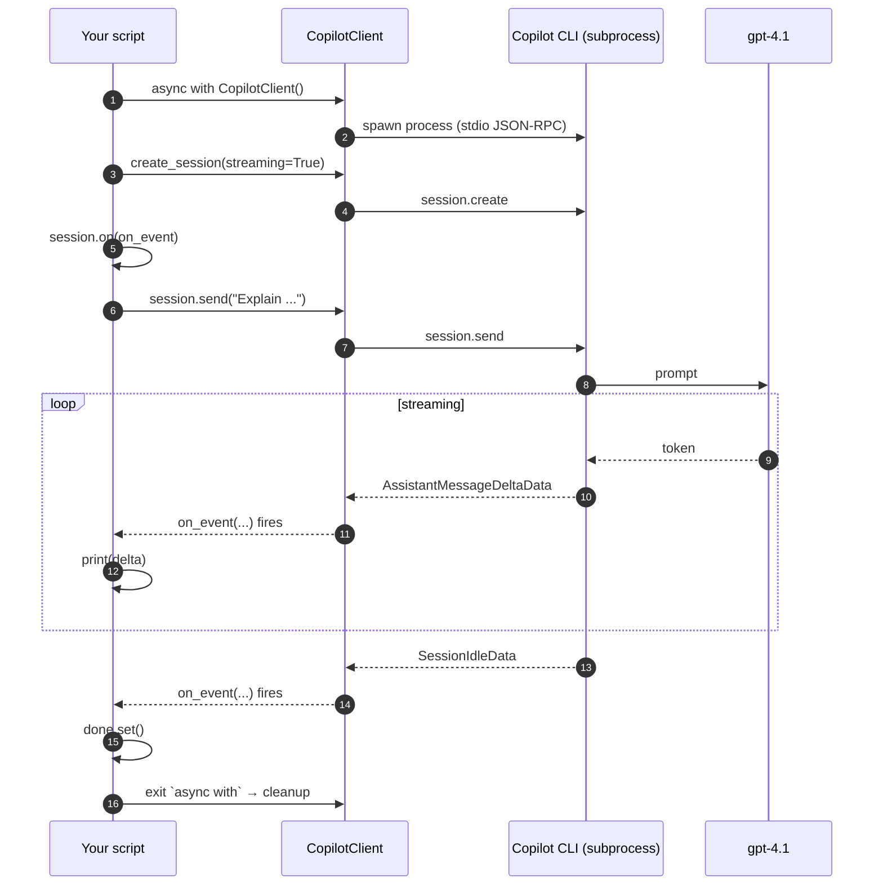

# 01 · Simple streaming chat

> The "hello world" of the GitHub Copilot SDK. Open a session, send a prompt,
> stream the response token by token.

## What you'll learn

- How to spin up a `CopilotClient` and a `CopilotSession` using async context
  managers (`async with`)
- How the SDK delivers responses through an **event stream** rather than a
  simple return value
- How to react to typed event payloads with Python's `match` / `case`
- The role of a **permission handler** (the SDK refuses to start without one)

## The flow



## Code walkthrough

### 1. Imports

```python
from copilot import CopilotClient
from copilot.generated.session_events import (
    AssistantMessageDeltaData,   # one for every streamed chunk
    SessionIdleData,             # one when the agent stops talking
)
from copilot.session import PermissionHandler
```

- `CopilotClient` is the top-level handle to the bundled Copilot CLI.
- The two `*Data` classes are the typed payloads of the events we care about.
  The SDK emits dozens — we only react to two.
- `PermissionHandler.approve_all` is a one-line built-in that auto-approves
  every tool call. **Fine for demos, never for production** — see [example 06](06_human_in_the_loop.md)
  for a real handler.

### 2. The client / session lifecycle

```python
async with CopilotClient() as client:
    async with await client.create_session(
        on_permission_request=PermissionHandler.approve_all,
        model="gpt-4.1",
        streaming=True,
    ) as session:
        ...
```

- `async with CopilotClient()` spawns the bundled CLI binary as a subprocess
  on enter and shuts it down on exit. No manual `start()` / `stop()` calls.
- `await client.create_session(...)` returns a context manager. The double
  `async with await ...` is the canonical pattern.
- `streaming=True` switches the model on to incremental output. Without it
  you'd get one big `AssistantMessageData` event at the end instead of a
  stream of `AssistantMessageDeltaData`.

### 3. The event listener

```python
done = asyncio.Event()

def on_event(event):
    match event.data:
        case AssistantMessageDeltaData(delta_content=delta):
            print(delta or "", end="", flush=True)
        case SessionIdleData():
            done.set()

session.on(on_event)
```

- The SDK is **fully event-driven**. `session.send()` returns immediately and
  the reply arrives as a stream of events.
- `match event.data` is a clean way to handle just the events that matter.
  Any other event simply falls through and is ignored.
- `flush=True` forces the terminal to render each fragment immediately —
  without it your "streaming" demo would look like a single big print.
- `done = asyncio.Event()` is how we hold the program open until the agent is
  finished. When `SessionIdleData` arrives we set it; the `await done.wait()`
  on the next line unblocks and the context managers tear down cleanly.

### 4. Sending the prompt

```python
await session.send("Explain what the GitHub Copilot SDK is in 3 sentences.")
await done.wait()
```

- `session.send(...)` takes a plain string. It does **not** return the reply.
- Without `await done.wait()` the program would exit while events were still
  in flight — you'd see nothing or a garbled half-response.

## Run it

```bash
python examples/01_simple_chat.py
```

Expected output (your wording will vary):

```
The GitHub Copilot SDK is a toolkit that enables developers to build, extend,
and customise AI-powered developer tools and workflows using GitHub Copilot's
capabilities. It provides APIs, libraries, and integration patterns ...
```

## Try this next

1. **Change the model** to `gpt-5-mini` (also free) and see if the reply style
   changes. List all available models with `await client.list_models()`.
2. **Turn streaming off** (`streaming=False`) and switch your `match` arm to
   `case AssistantMessageData(content=content): print(content)`. Note how the
   user experience changes.
3. **Send a follow-up turn** by calling `session.send(...)` a second time
   before exiting. The session remembers prior context for free.
4. **Print the event type** for every event (`print(type(event.data).__name__)`)
   to see the full lifecycle — `SessionStartedData`, `AssistantMessageStartData`,
   `AssistantMessageDeltaData`, ..., `SessionIdleData`.

## Common pitfalls

- **Missing `on_permission_request`** raises `ValueError` at session creation —
  the SDK won't run an agent without one.
- **Forgetting `await done.wait()`** makes the program exit silently with no
  output.
- **`print(delta)` without `end=""`** adds a newline per token, ruining the
  illusion of streaming.
- On Windows, **`UnicodeEncodeError`** on the console: `set PYTHONIOENCODING=utf-8`.

## Further reading

- Upstream getting-started: <https://github.com/github/copilot-sdk/blob/main/docs/getting-started.md>
- Event payloads: see `copilot/generated/session_events.py` in the installed SDK
