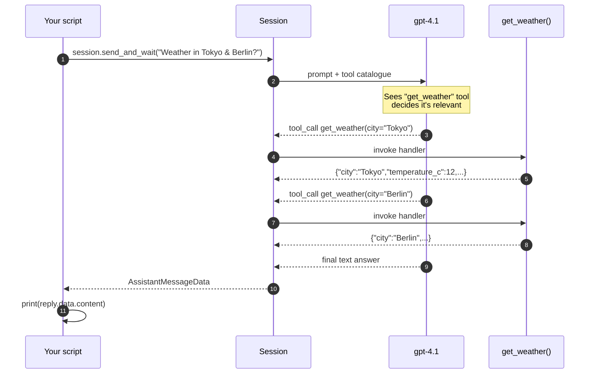

# 02 · Custom tools

📖 **Source:** [`github/copilot-sdk · python/ — Tools`](https://github.com/github/copilot-sdk/tree/main/python#tools) &middot; [`docs/features/index.md`](https://github.com/github/copilot-sdk/blob/main/docs/features/index.md)

> Give the agent a Python function it can call on its own. Here it's a fake
> weather lookup; in a real app it could be a DB query, an HTTP call to your
> internal API, or anything else.

## What you'll learn

- How to declare a tool with `@define_tool`
- Why the tool's parameters live in a **Pydantic** model — the SDK turns it
  into the JSON-Schema the model sees
- How to register tools with a session via `tools=[...]`
- The difference between `session.send(...)` (event-driven) and
  `session.send_and_wait(...)` (request/response)

## The flow



## Code walkthrough

### 1. Describing parameters with Pydantic

```python
class WeatherParams(BaseModel):
    city: str = Field(description="City name, e.g. 'Seattle'")
```

The `Field(description=...)` text is the **only hint the model sees** about
what to put in that argument. Treat it like a tiny piece of prompt engineering:

- ✅ `"Three-letter ISO currency code (e.g. 'EUR', 'USD')"`
- ❌ `"the currency"`

### 2. Declaring the tool

```python
@define_tool(description="Get the current weather for a given city")
async def get_weather(params: WeatherParams) -> dict:
    return {
        "city": params.city,
        "temperature_c": random.randint(-5, 35),
        "condition": random.choice(["sunny", "cloudy", "rainy"]),
    }
```

- `@define_tool` packages your function + Pydantic schema into a `Tool` object
  the SDK can ship to the model.
- The `description` is what makes the model pick this tool over another, so
  be explicit (e.g. *"Get current weather. Only call this if the user asks
  about weather in a specific city"*).
- The return value can be any JSON-serialisable object; the model receives
  it back as the tool result and weaves it into the answer.

### 3. Wiring the tool into the session

```python
async with await client.create_session(
    on_permission_request=PermissionHandler.approve_all,
    model="gpt-4.1",
    tools=[get_weather],
) as session:
    ...
```

`tools=[...]` registers them **for this session only**. Other sessions on the
same client don't see them.

### 4. One-shot reply with `send_and_wait`

```python
reply = await session.send_and_wait(
    "What's the weather in Tokyo and Berlin?"
)
if reply:
    print(reply.data.content)
```

- `send_and_wait` is the *"give me the final answer"* shortcut. Under the
  hood it does what [example 01](01_simple_chat.md) does manually: register a
  listener, wait for `SessionIdleData`, return the last `AssistantMessage`.
- `reply` is `None` if the default 60 s timeout fires before the agent
  finishes — always check, or pass `timeout=…` to extend it.

## Run it

```bash
python examples/02_custom_tools.py
```

Expected output (numbers vary — the data is random):

```
The current weather is:
- Tokyo: Sunny, -5°C
- Berlin: Rainy, 11°C
```

## Try this next

1. **Add a second tool** `convert_temperature(celsius: float, to: str)` that
   converts to Fahrenheit or Kelvin. Ask: *"What's the weather in Tokyo in
   Fahrenheit?"* — the model should chain both tools.
2. **Make the description vague** (`description="weather thing"`) and watch
   how the model stops calling it. This is your best intuition pump for how
   important descriptions are.
3. **Make the tool raise an exception** and see how the agent reports the
   failure to the user — usually it gracefully retries or apologises.
4. **Force a tool call** by adding `"You MUST call get_weather"` to the prompt
   and observe the agent's behaviour.

## Common pitfalls

- **No `description`** on `@define_tool` or `Field` → the model can't tell
  when to call your tool, so it never does.
- **Forgetting `async`** on the handler — `@define_tool` only supports
  `async def` functions in v0.3.x.
- **Returning a `BaseModel`** instead of a plain dict — Pydantic objects are
  not JSON-serialisable by default; call `.model_dump()` first.
- **Using mutable state** in handlers can race if the agent calls them in
  parallel — keep handlers pure and idempotent.

## Further reading

- Upstream tools doc: <https://github.com/github/copilot-sdk/blob/main/docs/features/tools.md>
- Pydantic v2 docs: <https://docs.pydantic.dev/latest/>
