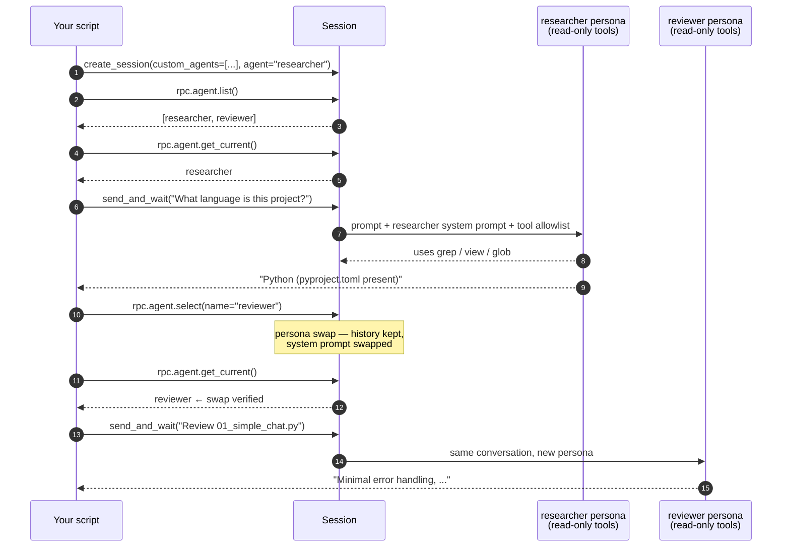

# 03 · Custom agents

> A **custom agent** is a named persona bundled with the session — a system
> prompt plus an allowlist of tools. You can switch between them mid-conversation
> without losing context.

## What you'll learn

- How to declare multiple agents with `custom_agents=[...]`
- How to pick the starting agent with `agent="..."`
- How to introspect the live session with `session.rpc.agent.list()` and
  `session.rpc.agent.get_current()`
- How to swap agents at runtime with `session.rpc.agent.select(...)` —
  conversation history is preserved across the swap
- When personas help: enforcing read-only researchers, opinionated reviewers,
  spec-bound writers, etc.

## The flow



## Code walkthrough

### 1. Defining the agents

```python
AGENTS = [
    {
        "name": "researcher",
        "description": "Read-only code researcher.",
        "tools": ["grep", "glob", "view"],
        "prompt": "You explore code and answer questions. Never modify files.",
    },
    {
        "name": "reviewer",
        "description": "Code reviewer focused on bugs and security.",
        "tools": ["grep", "glob", "view"],
        "prompt": "You review code for bugs, security issues, and clarity.",
    },
]
```

Each agent is a plain dict. Useful keys:

| Key | Purpose |
|-----|---------|
| `name` | Identifier you use later with `agent.select()` |
| `prompt` | System prompt that shapes the persona's behaviour |
| `tools` | Built-in tools this persona is allowed to use |
| `description` | Shown to the model when listing agents |

> The `tools` list **restricts** which built-ins the agent can call. Omitting
> the list means *"all built-ins"*. This is your safety net — a researcher
> with `tools=["grep","glob","view"]` literally cannot run `bash`.

### 2. Starting with one persona

```python
async with await client.create_session(
    on_permission_request=PermissionHandler.approve_all,
    model="gpt-4.1",
    custom_agents=AGENTS,
    agent="researcher",
) as session:
```

- `custom_agents` registers all available personas.
- `agent="researcher"` picks the active one for the first turn. Without it,
  the SDK's default agent is used.

### 3. Inspecting what's registered and active

```python
listing = await session.rpc.agent.list()
print("Registered agents:", ", ".join(a.name for a in listing.agents))

current = await session.rpc.agent.get_current()
print("Active persona:", current.agent.name)
```

`session.rpc` is the SDK's window onto the JSON-RPC server the CLI runs.
Each namespace (`agent`, `permissions`, `tools`, `model`, `mcp`, …) maps to
the underlying methods. For agents the useful trio is:

| Call | Returns | Why you care |
|---|---|---|
| `agent.list()` | every registered persona | sanity-check that `custom_agents=[...]` was accepted |
| `agent.get_current()` | the active persona | **the definitive way to verify a swap really happened** |
| `agent.select(...)` | swaps personas | the swap itself |

### 4. Talking to the first persona

```python
reply = await session.send_and_wait(
    "What programming language is this project written in?",
    timeout=120,
)
```

We pass `timeout=120` because the researcher may run multiple `grep`/`view`
calls before answering — the 60 s default is sometimes too short.

### 5. Swapping persona mid-conversation

```python
await session.rpc.agent.select(AgentSelectRequest(name="reviewer"))

current = await session.rpc.agent.get_current()
print(f"--- swapped --- Active persona: {current.agent.name}")
```

The follow-up `get_current()` call is the cheapest possible proof that the
swap landed before you send the next prompt. Responses alone are
circumstantial evidence — the runtime state is the truth.

After the swap:

- The **conversation history is kept** — the reviewer sees everything the
  researcher said.
- The **system prompt is replaced** with the reviewer's.
- The **tool allowlist** is replaced too — try giving the reviewer
  `tools=["view"]` and watch it refuse to grep.

### 6. Talking to the second persona

```python
reply = await session.send_and_wait(
    "Review examples/01_simple_chat.py for error handling issues.",
    timeout=120,
)
```

Same session, different brain — the answer style flips noticeably.

## Run it

```bash
python examples/03_custom_agents.py
```

Expected output (abbreviated):

```
Registered agents: researcher, reviewer
Active persona: researcher

Researcher: This project is written in Python. The presence of multiple
`.py` files in the repository indicates Python as the primary programming
language.

--- swapped --- Active persona: reviewer

Reviewer: The file `examples/01_simple_chat.py` has minimal error handling.
Potential issues:
- If `CopilotClient` or `create_session` fails ...
- The `on_event` handler does not handle unexpected event types ...
- No try/except blocks around async operations ...
```

The `Active persona:` lines are what prove the swap. If you see
`Active persona: researcher` followed by `--- swapped --- Active persona:
reviewer`, the `agent.select()` round-trip landed before the next `send`.

## Try this next

1. **Add a third persona** — `tester` — with prompt *"Write pytest cases for
   any code I show you"* and tools `["view", "write"]`. Hand it the
   `01_simple_chat.py` file and see if it can produce a sensible test.
2. **Tighten tool access** on the reviewer (`tools=["view"]` only) and verify
   it can no longer use grep — it'll have to read files end-to-end.
3. **Try a "specialist swarm" pattern**: 4 agents (planner, coder, tester,
   reviewer) and a small loop in your script that hands off between them.
4. **Inspect `session.rpc`** at runtime — `print(dir(session.rpc))` to see
   what other namespaces are available (try `session.rpc.model.list()`).

## Common pitfalls

- **Setting `tools` to `[]`** disables *all* built-ins (including read tools)
  for that persona — usually not what you want.
- **Forgetting `agent="..."` at creation** means the default persona runs the
  first turn, even if you only defined custom ones.
- **`session.rpc.<namespace>` not in `dir(session.rpc)`** — they're set in
  `__init__` dynamically; the call still works.
- Custom agents do **not** affect MCP servers — MCP tools are always
  available to every persona.

## Further reading

- Upstream agents doc: <https://github.com/github/copilot-sdk/blob/main/docs/features/custom-agents.md>
- The CLI's own agent system is exposed the same way — every Copilot CLI
  agent is just a JSON config.
