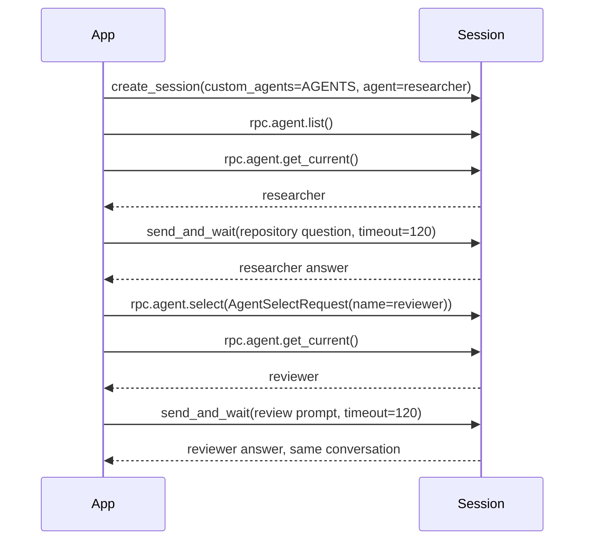

# 03 · Custom agents

📖 **Sources (SDK v1.0.13):**
[custom agents](https://github.com/github/copilot-sdk/blob/v1.0.13/docs/features/custom-agents.md),
[typed RPC](https://github.com/github/copilot-sdk/blob/v1.0.13/python/copilot/generated/rpc.py),
[Python client](https://github.com/github/copilot-sdk/blob/v1.0.13/python/copilot/client.py).

Open [the runnable source](03_custom_agents.py). Two named personas share
one conversation: a researcher answers a repository question, then a
reviewer examines example 01. The app verifies the active agent through RPC.

## The flow


```mermaid
sequenceDiagram
    participant App
    participant Session
    App->>Session: create_session(custom_agents=AGENTS, agent=researcher)
    App->>Session: rpc.agent.list()
    App->>Session: rpc.agent.get_current()
    Session-->>App: researcher
    App->>Session: send_and_wait(repository question, timeout=120)
    Session-->>App: researcher answer
    App->>Session: rpc.agent.select(AgentSelectRequest(name=reviewer))
    App->>Session: rpc.agent.get_current()
    Session-->>App: reviewer
    App->>Session: send_and_wait(review prompt, timeout=120)
    Session-->>App: reviewer answer, same conversation
```

## Code walkthrough

### 1. Declare personas

Each entry in `AGENTS` is a dictionary with `name`, `description`, `prompt`
and `tools`. Both agents use `["grep", "glob", "view"]`; their instructions
differ. The session also applies:

```python
available_tools=["builtin:grep", "builtin:glob", "builtin:view"],
custom_agents=AGENTS,
agent="researcher",
```

Session filters apply globally; per-agent scopes operate within that
catalogue. Registering custom agents does not automatically select one:
`agent="researcher"` makes the initial choice explicit.

These are tool-exposure controls, **not an OS sandbox**. Read tools can
expose sensitive files; use a trusted, non-sensitive checkout when granting
`approve_all`. Instructions such as “Never modify files” are not security
boundaries by themselves. Do not assume every MCP tool bypasses agent scope.

### 2. Verify the initial state

```python
listing = await session.rpc.agent.list()
current = await session.rpc.agent.get_current()
if current.agent is None or current.agent.name != "researcher":
    raise RuntimeError("The researcher persona was not selected.")
```

The selected agent can be absent, so check before dereferencing `.name`.
The list can also contain runtime-provided agents; the example does not
assume it contains exactly two entries.

### 3. Ask, then switch

After the researcher's bounded turn completes:

```python
await session.rpc.agent.select(AgentSelectRequest(name="reviewer"))
current = await session.rpc.agent.get_current()
if current.agent is None or current.agent.name != "reviewer":
    raise RuntimeError("The reviewer persona was not selected.")
```

The typed `AgentSelectRequest` comes from `copilot.rpc`. Selection changes
the active persona without starting a new session. Existing conversation
context remains subject to the runtime's normal context/compaction behavior.
Verify via RPC rather than judging a persona solely from its writing style.

### 4. Handle failure and cleanup

Each `send_and_wait` uses 120 seconds; the outer `asyncio.timeout(360)`
bounds setup, RPC inspection and both turns together. Missing messages,
selection mismatches, session errors and timeouts fail visibly. Session
exit detaches; client exit stops the owned runtime.

## Run it

```bash
python examples/03_custom_agents.py
```

Illustrative output:

```text
Registered agents: researcher, reviewer, ...
Active persona: researcher
Researcher: The runnable prototypes use Python ...
--- swapped --- Active persona: reviewer
Reviewer: The first example bounds completion and unregisters its listener ...
```

Exact wording/tool calls vary. The `Active persona` checks, not the example
prose above, demonstrate a successful switch.

## Try this next

1. Add a third read-only persona that explains code to a beginner.
2. Give the reviewer only `["view"]` and compare its tool choices.
3. Select an invalid name in a mocked test and verify that no second prompt
   is sent after selection fails.
4. Inspect `await client.list_models()` before trying another account-enabled model.

## Common pitfalls

- A persona is not a separate client or separate conversation.
- A per-agent allowlist cannot restore tools removed session-wide.
- `current.agent` need not always be populated.
- Avoid assuming a style change proves the typed selection RPC succeeded.
- Keep shell/write tools out of this read-only exercise.
