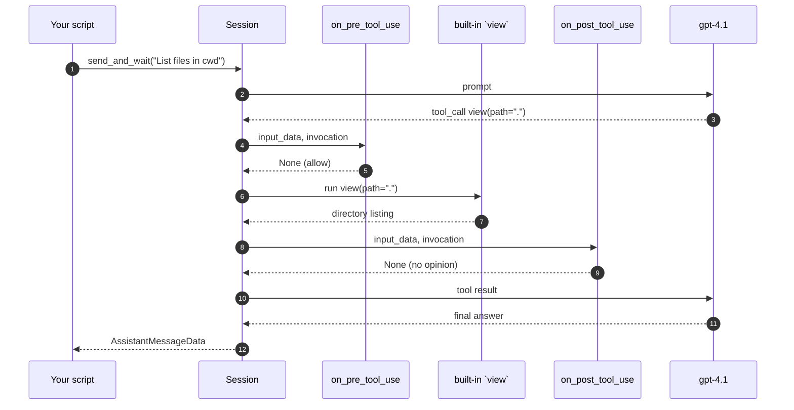

# 04 · Hooks

📖 **Source:** [`github/copilot-sdk · docs/features/hooks.md`](https://github.com/github/copilot-sdk/blob/main/docs/features/hooks.md)

> Hooks are callbacks the SDK fires at well-defined points in the agent's
> lifecycle: *just before* a tool runs, *just after*, on user prompt, on
> stop, etc. Perfect for cross-cutting concerns that don't belong in a tool.

## What you'll learn

- The full hook signature and return-value protocol
- When to use a hook vs. a custom tool vs. a permission handler
- How `on_pre_tool_use` can **block** a call, **rewrite arguments** or
  inject **additional context**
- How `on_post_tool_use` lets you log, cache or audit results

## The flow



## Code walkthrough

### 1. The hook signature

Both hooks share the same shape:

```python
async def on_pre_tool_use(input_data, invocation):
    ...
    return None    # or a decision dict
```

| Argument | Contents |
|----------|----------|
| `input_data` | `{ "toolName": str, "toolInput": dict, "timestamp": int, "cwd": str, ... }` |
| `invocation` | `{ "session_id": str }` — context if you have many sessions |

The return value controls what happens next:

| Return | Meaning |
|--------|---------|
| `None` | No opinion — proceed as normal |
| `{ "permissionDecision": "allow" }` | Force-allow (skips the permission handler) |
| `{ "permissionDecision": "deny", "permissionDecisionReason": "..." }` | Block the call; the agent sees the reason and can adapt |
| `{ "permissionDecision": "ask" }` | Defer to the permission handler |
| `{ "modifiedArgs": { ... } }` | Replace the tool's arguments before it runs |
| `{ "additionalContext": "..." }` | Append extra context to the tool's input |
| `{ "suppressOutput": True }` | Hide the tool's output from the model |

### 2. The two hooks in this example

```python
async def on_pre_tool_use(input_data, invocation):
    print(f"[pre]  {input_data['toolName']}")
    return None  # allow

async def on_post_tool_use(input_data, invocation):
    print(f"[post] {input_data['toolName']} done")
    return None
```

Both just log to the console — the simplest possible audit trail.

### 3. Registering hooks

```python
async with await client.create_session(
    on_permission_request=PermissionHandler.approve_all,
    model="gpt-4.1",
    hooks={
        "on_pre_tool_use": on_pre_tool_use,
        "on_post_tool_use": on_post_tool_use,
    },
) as session:
```

Hooks are registered as a **plain dict** keyed by hook name. The SDK
recognises several others — pick the ones you need:

| Hook | When it fires |
|------|---------------|
| `on_pre_tool_use` | Before any tool (built-in or custom) is invoked |
| `on_post_tool_use` | After a tool returns (success or failure) |
| `on_user_prompt_submitted` | After the user hits send, before the model sees the prompt |
| `on_session_start` | Once, when the session connects |
| `on_session_end` | Once, when the session disconnects |
| `on_error_occurred` | Whenever the SDK or CLI raises an error |

### 4. The prompt

```python
reply = await session.send_and_wait(
    "List the files in the current directory.",
    timeout=120,
)
```

This is chosen because it forces the agent to use at least one built-in tool
(usually `glob` or `view`) — so you can actually see both hooks fire.

## Run it

```bash
python examples/04_hooks.py
```

Expected output:

```
[pre]  view
[post] view done

  The current directory contains the following files and folders:
- .devcontainer
- .git
- ...
```

## Try this next

1. **Build a real audit log** — append to a JSON-Lines file with
   `{timestamp, toolName, args}` for every call. Now you have a forensic
   record of what the agent did.
2. **Block a tool** dynamically:

   ```python
   FORBIDDEN = {"bash", "shell"}
   async def on_pre_tool_use(inp, inv):
       if inp["toolName"] in FORBIDDEN:
           return {
               "permissionDecision": "deny",
               "permissionDecisionReason": "Shell is disabled in this app.",
           }
       return None
   ```
3. **Rewrite arguments** — intercept `view` calls and rewrite any absolute
   path that escapes a sandbox dir to a safe value, using `modifiedArgs`.
4. **Add `on_user_prompt_submitted`** that prepends *"Always reply in
   bullet points"* — a poor-man's persona system.
5. **Time the tool calls** — start a timer in pre-hook, log the delta in
   post-hook. You'll quickly find slow tools.

## Common pitfalls

- **Returning a truthy value** like `True` is **not** the same as
  `{"permissionDecision": "allow"}` — only the typed dict is recognised.
- **Hooks must be `async def`** — sync functions are wrapped automatically
  but it's noisy and error-prone.
- **Long-running hooks** block the agent — keep them fast (≤ 100 ms).
  Offload heavy work to a queue.
- **Throwing in a hook** is treated as a hard failure — wrap with
  `try/except` if you have flaky I/O.

## Further reading

- Upstream hooks doc: <https://github.com/github/copilot-sdk/blob/main/docs/features/hooks.md>
- Hook input/output TypedDicts: see `copilot/session.py` in the installed SDK
  (search for `PreToolUseHookInput`, `PreToolUseHookOutput`, etc.)
