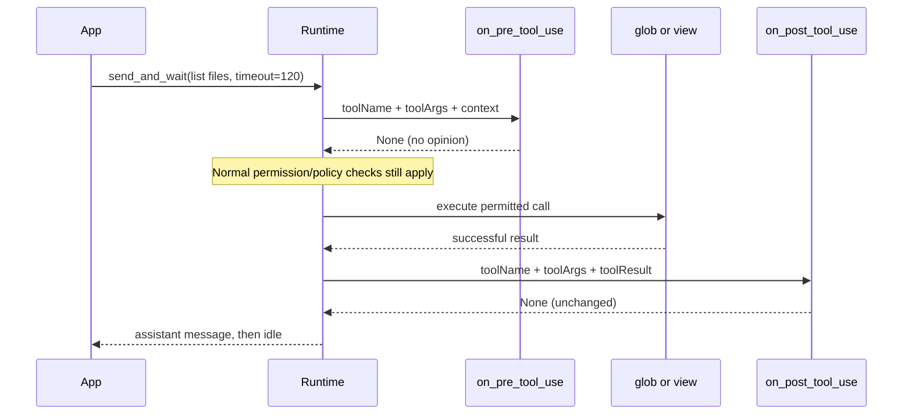

# 04 · Hooks

📖 **Sources (SDK v1.0.13):**
[hook overview](https://github.com/github/copilot-sdk/blob/v1.0.13/docs/features/hooks.md),
[Python hook types and dispatch](https://github.com/github/copilot-sdk/blob/v1.0.13/python/copilot/session.py),
[pre-tool-use](https://github.com/github/copilot-sdk/blob/v1.0.13/docs/hooks/pre-tool-use.md).

Open [the runnable source](04_hooks.py). Three callbacks print tool names
while the agent lists the current directory. `glob` and `view` are the
only session tools; shell/write tools are not exposed.

## The flow


```mermaid
sequenceDiagram
    participant App
    participant Runtime
    participant Pre as on_pre_tool_use
    participant Tool as glob or view
    participant Post as on_post_tool_use
    App->>Runtime: send_and_wait(list files, timeout=120)
    Runtime->>Pre: toolName + toolArgs + context
    Pre-->>Runtime: None (no opinion)
    Note over Runtime: Normal permission/policy checks still apply
    Runtime->>Tool: execute permitted call
    Tool-->>Runtime: successful result
    Runtime->>Post: toolName + toolArgs + toolResult
    Post-->>Runtime: None (unchanged)
    Runtime-->>App: assistant message, then idle
```

## Code walkthrough

### 1. Observe without logging secrets

```python
async def on_pre_tool_use(input_data, invocation):
    print(f"[pre]  {input_data['toolName']}")
    return None

async def on_post_tool_use(input_data, invocation):
    print(f"[post] {input_data['toolName']} succeeded")
    return None

async def on_post_tool_use_failure(input_data, invocation):
    print(f"[failed] {input_data['toolName']}")
    return None
```

`None` means **no opinion**, not “force allow.” `on_post_tool_use` runs
**after successful execution only**; failed results use
`on_post_tool_use_failure` instead. The example logs names only: arguments
and results can include private source, tokens or personal data.

The tagged Python `PreToolUseHookInput` contains:

| Field | Type / meaning |
|---|---|
| `sessionId` | Runtime session ID |
| `timestamp` | `datetime` in the Python type |
| `workingDirectory` | Working directory |
| `toolName` | Tool identifier |
| `toolArgs` | Arguments (`Any`, not necessarily an object) |
| `toolResult` | Post-hook only: returned result |

The separate `invocation` context contains `session_id`.
Older walkthrough spellings `toolInput` / `cwd` are not these Python types.

### 2. Register callbacks

```python
available_tools=["builtin:glob", "builtin:view"],
hooks={
    "on_pre_tool_use": on_pre_tool_use,
    "on_post_tool_use": on_post_tool_use,
    "on_post_tool_use_failure": on_post_tool_use_failure,
},
```

The SDK accepts synchronous or asynchronous callbacks. Use non-blocking
async I/O if a hook must call a service. Callbacks should stay short.

### 3. Distinguish hook output shapes

| Pre-tool output | Meaning |
|---|---|
| `None` | No override; normal handling continues |
| `{"permissionDecision": "allow"}` | Request approval under runtime policy |
| `{"permissionDecision": "deny", "permissionDecisionReason": "..."}` | Deny with a reason |
| `{"permissionDecision": "ask"}` | Defer to permission handling |
| `{"modifiedArgs": ...}` | Replace arguments |
| `{"additionalContext": "..."}` | Supply additional context |

Post-tool output instead supports `modifiedResult`, `additionalContext`
and `suppressOutput`. Do not return pre-tool decision fields from a post
hook and expect enforcement. Runtime managed policy can still restrict
tool use; hooks and `approve_all` are not a sandbox or policy bypass.

### 4. Know the related hooks

The tagged **hooks overview lists eight hooks**, rather than the original six:

| Python callback | When it fires |
|---|---|
| `on_session_start` | Session begins, new or resumed |
| `on_user_prompt_submitted` | User sends a message |
| `on_user_prompt_transformed` | Runtime builds the model-facing prompt |
| `on_pre_tool_use` | Before tool execution |
| `on_post_tool_use` | After successful tool execution only |
| `on_post_tool_use_failure` | After a tool returns failure |
| `on_session_end` | Runtime session ends |
| `on_error_occurred` | Runtime reports an error |

The tagged Python `SessionHooks` type additionally exposes
`on_pre_mcp_tool_call` and `on_agent_stop`; the eight-row overview is not
the complete Python type surface. This demo registers pre-tool, successful
post-tool and failed-result callbacks. A failed call uses the failure hook,
not the success hook; an absent post-success event is not missing cleanup.

Session detachment is also not necessarily the end of a shared runtime
session. Do not rely on `on_session_end` as the only place to clean up
application-owned resources; use context managers / `finally`.

## Run it

```bash
python examples/04_hooks.py
```

Illustrative output:

```text
[pre]  view
[post] view succeeded
The repository contains README.md, examples/, docs/, ...
```

The prompt **requests** tool use; only an observed trace shows a call happened.
`send_and_wait(timeout=120)` raises on timeout/session error. `None` raises
a visible error in this example. The surrounding operation has a 180-second
deadline and uses normal session/client cleanup.

## Try this next

1. Return an explicit denial for a tool and observe the failure path.
2. Request a nonexistent file and observe the failed-result trace.
3. Record duration with a correlation key; avoid conflating concurrent calls.
4. Add a mocked hook test that checks the correct output dictionary keys.

## Common pitfalls

- `True` is not a valid replacement for a structured hook result.
- `None` does not bypass the required permission handler.
- A hook exception is not an explicit policy-denial contract. Return the
  documented decision instead of relying on exception behavior.
- Rewriting a path alone is not a complete filesystem security boundary.
