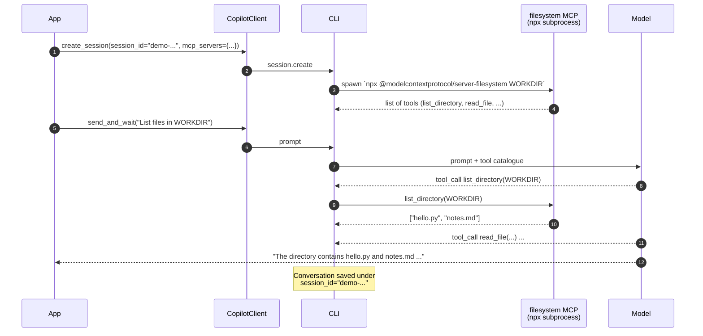
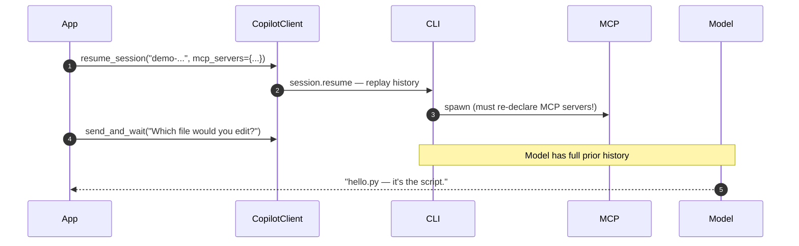

# 05 · MCP servers + session persistence

> Two features bundled together because real assistants use them together:
>
> 1. **MCP servers** plug standardised tool servers (filesystem, GitHub,
>    Slack, ...) into the agent.
> 2. **Session persistence** lets the same conversation continue across
>    process restarts, days, deployments — anywhere.

## What you'll learn

- The MCP (Model Context Protocol) configuration format
- Why we sandbox an MCP server by passing it a working directory
- How to reuse a session by ID with `create_session(session_id=...)` and
  `client.resume_session(session_id, ...)`
- What's preserved across a resume and what isn't

## The flow

### First run



### Later: resume



## Code walkthrough

### 1. The session ID

```python
SESSION_ID = "demo-mcp-persistent-session"
```

A stable, app-chosen string. In production this would be a UUID stored next
to your user — *"every conversation has an ID; persist it"*.

### 2. The MCP server configuration

```python
MCP_SERVERS = {
    "filesystem": {
        "type": "local",
        "command": "npx",
        "args": ["-y", "@modelcontextprotocol/server-filesystem", WORKDIR],
        "tools": ["*"],
    },
}
```

| Key | Meaning |
|-----|---------|
| `type` | `"local"` = spawn a process and talk JSON-RPC over stdio. Also valid: `"http"`, `"sse"`, `"streamable-http"`. |
| `command` | Executable to launch (`npx` downloads the server on first use). |
| `args` | Arguments. The trailing `WORKDIR` is the **sandbox root** — without it the server would expose your entire disk. |
| `tools` | Which of the server's tools to expose to the agent. `"*"` = all. |

> 💡 The MCP ecosystem is huge — see
> [github/modelcontextprotocol/servers](https://github.com/modelcontextprotocol/servers)
> for an up-to-date directory. Most servers are configured exactly like the
> one above.

### 3. First-run branch

```python
session_ctx = await client.create_session(
    on_permission_request=PermissionHandler.approve_all,
    model="gpt-4.1",
    session_id=SESSION_ID,        # ← stable, our choice
    mcp_servers=MCP_SERVERS,
)
prompt = f"List the files in {WORKDIR} and summarise each one."
```

Pass our chosen `session_id` so the SDK persists the conversation under that
key. Without it the SDK assigns a random UUID and resume is impossible.

### 4. Resume branch

```python
session_ctx = await client.resume_session(
    SESSION_ID,
    on_permission_request=PermissionHandler.approve_all,
    mcp_servers=MCP_SERVERS,      # ← must re-declare
)
prompt = "Based on our earlier chat, which file would you edit to add a feature?"
```

What you *don't* re-pass: `model`. The original model is reused.

What you **must** re-pass:

- `on_permission_request` — handlers don't persist
- `mcp_servers` — they're per-process and need re-spawning
- `tools=…` — custom Python tools obviously aren't on disk

### 5. The unified context manager

```python
async with session_ctx as session:
    reply = await session.send_and_wait(prompt, timeout=180)
    if reply:
        print(reply.data.content)
```

Both branches converge to the same `async with`, then send a prompt. Notice
the longer timeout — the first run also has to `npx`-install the filesystem
server, which can be slow.

## Run it

```bash
# First run — creates the session and lists the files
python examples/05_mcp_and_persistence.py

# Later (minutes, hours, days) — same conversation
python examples/05_mcp_and_persistence.py --resume
```

Expected output (first run, abbreviated):

```
The directory contains:
1. hello.py: A Python script with a single line: print("hello").
2. notes.md: A markdown file with a heading "Notes" ...

Session saved as 'demo-mcp-persistent-session'. Re-run with --resume to continue.
```

Resume:

```
To add a feature, you would edit hello.py. This is the Python script where
new functionality or features should be implemented.
```

Notice how the resumed reply only makes sense because the model remembers
the file listing from the first run.

## Try this next

1. **Add a second MCP server** — `git` is a great choice:
   ```python
   "git": {
       "type": "local",
       "command": "uvx",
       "args": ["mcp-server-git", "--repository", REPO_PATH],
       "tools": ["*"],
   }
   ```
2. **Change the model on resume** — wait, you can't (the resume reuses the
   original). What you *can* do is start a *new* session that uses the old
   session's transcript as the system prompt. Try implementing that.
3. **Build a tiny chatbot loop** — `while True: prompt = input(); send_and_wait(...)`.
   Save the session ID to disk and reload on next start.
4. **Restrict the MCP tool list** — `"tools": ["list_directory"]` only.
   Verify the agent can no longer read files.

## Common pitfalls

- **`npx` not installed** → MCP filesystem server can't start. In the
  Codespace this is pre-installed.
- **Resuming without `mcp_servers`** → the agent loses access to MCP tools,
  but doesn't tell you why.
- **Reusing a session_id you've already deleted** raises a RuntimeError.
- **WORKDIR not absolute** → some MCP servers refuse to start; pass an
  absolute path.
- **Slow first-run `npx`** → the 60 s default timeout often trips. Use
  `timeout=180` or longer.

## Further reading

- MCP spec: <https://modelcontextprotocol.io/>
- Server directory: <https://github.com/modelcontextprotocol/servers>
- Upstream MCP doc: <https://github.com/github/copilot-sdk/blob/main/docs/features/mcp.md>
- Upstream sessions doc: <https://github.com/github/copilot-sdk/blob/main/docs/features/sessions.md>
