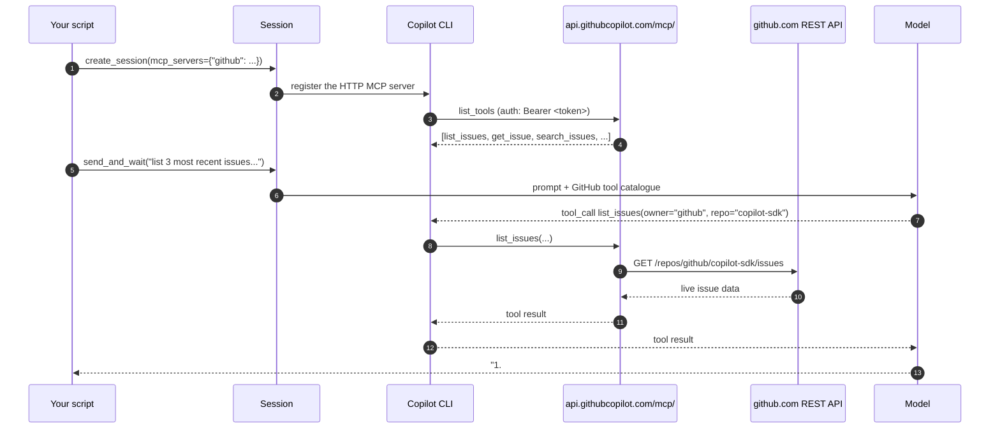

# 05 · MCP servers (remote GitHub MCP)

📖 **Source:** [`github/copilot-sdk · docs/features/mcp.md`](https://github.com/github/copilot-sdk/blob/main/docs/features/mcp.md) &middot; [GitHub MCP server](https://github.com/github/github-mcp-server) &middot; [MCP spec](https://modelcontextprotocol.io)

> **MCP** (Model Context Protocol) is the standard plug-in format for LLM tools.
> Hundreds of servers already exist — filesystem, git, GitHub, Slack, Notion,
> databases. The SDK attaches one with a single `mcp_servers={...}` kwarg.

In this example we wire up the **official remote GitHub MCP server** hosted
by GitHub itself (`https://api.githubcopilot.com/mcp/`) and ask the agent
about live issues in the `github/copilot-sdk` repo — the SDK introspecting
its own roadmap.

## What you'll learn

- The two MCP transports the SDK ships with: `local` (subprocess + stdio)
  and `http` (remote URL)
- How to authenticate a remote MCP server with a `Bearer` header
- How to narrow exposure with an explicit `tools` allowlist
- Why we use `gh auth token` as a sensible default for getting credentials

## Why the remote GitHub MCP server

| | Local (`npx`/Docker server) | Remote (`api.githubcopilot.com`) |
|---|---|---|
| Install | `npx -y @modelcontextprotocol/server-github` or Docker | Zero — it's just an HTTPS URL |
| Updates | You upgrade manually | GitHub maintains it |
| Latency | One round-trip to local subprocess | One round-trip to api.githubcopilot.com |
| Auth | PAT in env var | `Authorization: Bearer …` header |
| Best for | Air-gapped, offline, custom builds | The default — what you want unless you can't |

## The flow



## Code walkthrough

### 1. Pick a token source

```python
def github_token() -> str:
    for var in ("GITHUB_TOKEN", "GH_TOKEN"):
        if os.environ.get(var):
            return os.environ[var]
    return subprocess.check_output(["gh", "auth", "token"], text=True).strip()
```

Order of preference:

1. **`GITHUB_TOKEN`** — CI friendly. GitHub Actions sets this automatically.
2. **`GH_TOKEN`** — gh CLI convention.
3. **`gh auth token`** — graceful fallback for local development; uses
   whatever account you logged in with via `gh auth login`.

> 💡 In a real backend you'd inject a service-account PAT (or an
> installation token from a GitHub App). For the workshop your
> `gh auth login` token is plenty.

### 2. Declare the HTTP MCP server

```python
MCP_SERVERS = {
    "github": {
        "type": "http",
        "url": "https://api.githubcopilot.com/mcp/",
        "headers": {"Authorization": f"Bearer {github_token()}"},
        "tools": ["list_issues", "get_issue", "search_issues"],
    },
}
```

| Key | Meaning |
|-----|---------|
| `type` | `"http"` = talk to a remote MCP server. Also valid: `"sse"`. For subprocess-based servers use `"local"` (or `"stdio"`). |
| `url` | Server endpoint. Path matters — trailing `/mcp/` is required. |
| `headers` | Sent on every request. Use this for `Authorization`, custom tracing headers, tenant IDs, etc. |
| `tools` | **Allowlist** — only these tools are exposed to the agent. Use `["*"]` to expose everything the server offers. |

> 🔒 The `tools` allowlist is your blast-radius control. The remote
> GitHub MCP server can do hundreds of things (create PRs, merge,
> trigger workflows). Listing read-only tools means the agent
> *physically cannot* mutate anything, even if it tries.

### 3. Use it like any other session

```python
async with await client.create_session(
    on_permission_request=PermissionHandler.approve_all,
    model="gpt-4.1",
    mcp_servers=MCP_SERVERS,
) as session:
    reply = await session.send_and_wait(
        "Use the GitHub MCP server to list the 3 most recently "
        f"opened issues on {TARGET_REPO_OWNER}/{TARGET_REPO_NAME}. "
        "For each issue, give me the number, title, and author.",
        timeout=180,
    )
```

The `timeout=180` is generous — first connection to the remote MCP server
adds ~1–2 s. Subsequent tool calls are quick.

## Run it

```bash
python examples/05_mcp_servers.py
```

Expected output (live data — yours will differ):

```
Here are the 3 most recently opened issues on github/copilot-sdk:

1. #1419 — "Copilot sdk silently fails with ..." (author: ajasingh)
2. #1417 — "Mark anthony pedrosa" (author: markanthonypedrosa145-sudo)
3. #1416 — "Mark anthony pedrosa" (author: markanthonypedrosa145-sudo)
```

Because the issues are newer than the model's training cutoff, the only way
the model can answer is by actually calling the MCP tool. That's your
proof the MCP server is in the loop.

## Try this next

1. **Point it at another repo** — change `TARGET_REPO_NAME` to
   `vscode`, `cpython`, `linux`, or your own project.
2. **Add more tools** — extend the allowlist with `get_pull_request`,
   `search_code`, `get_file_contents`, etc. Ask the agent to summarise
   recent PRs.
3. **Swap to a local MCP server** — install
   [`@modelcontextprotocol/server-filesystem`](https://github.com/modelcontextprotocol/servers/tree/main/src/filesystem)
   and try the local/stdio path against a temp directory.
4. **Chain two MCP servers** — register `github` + `filesystem` in the
   same dict. The agent can now read both your code and the upstream
   issues.

## Common pitfalls

- **No token** — the script raises a clear `RuntimeError` if neither
  `GITHUB_TOKEN`/`GH_TOKEN` nor `gh auth token` is available.
- **PATs without `repo` scope** — read-only org repos still need it.
  GitHub Actions tokens are usually scoped enough.
- **Forgetting the trailing slash** on `https://api.githubcopilot.com/mcp/`
  — the path matters.
- **First call too slow** — the default 60 s timeout sometimes trips
  on cold connections. Use `timeout=180`.
- **`tools: ["*"]` in production** — fine for demos, dangerous for
  agents. Always narrow the allowlist.

## Further reading

- Remote GitHub MCP server: <https://github.com/github/github-mcp-server>
- MCP spec: <https://modelcontextprotocol.io/>
- Community server directory:
  <https://github.com/modelcontextprotocol/servers>
- Upstream SDK MCP doc:
  <https://github.com/github/copilot-sdk/blob/main/docs/features/mcp.md>
