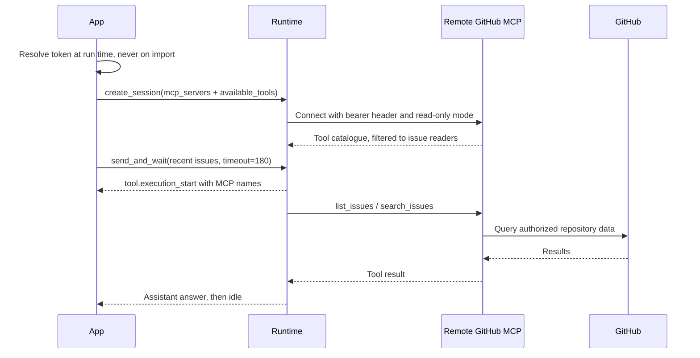

# 05 · Remote GitHub MCP

📖 **Sources:**
[SDK v1.0.13 MCP configuration](https://github.com/github/copilot-sdk/blob/v1.0.13/docs/features/mcp.md),
[SDK tool filter names](https://github.com/github/copilot-sdk/blob/v1.0.13/python/test_tool_set.py),
[GitHub MCP v1.12.0 issue tools](https://github.com/github/github-mcp-server/blob/v1.12.0/pkg/github/issues.go),
[remote server](https://github.com/github/github-mcp-server/blob/v1.12.0/docs/remote-server.md).

Open [the runnable source](05_mcp_servers.py). It attaches GitHub's hosted
MCP endpoint and asks for recent issues from `github/copilot-sdk`.
**No Node.js, `npx`, Docker or local MCP server is required.**

## The flow


```mermaid
sequenceDiagram
    participant App
    participant Runtime
    participant MCP as Remote GitHub MCP
    participant GitHub
    App->>App: Resolve token at run time, never on import
    App->>Runtime: create_session(mcp_servers + available_tools)
    Runtime->>MCP: Connect with bearer header and read-only mode
    MCP-->>Runtime: Tool catalogue, filtered to issue readers
    App->>Runtime: send_and_wait(recent issues, timeout=180)
    Runtime-->>App: tool.execution_start with MCP names
    Runtime->>MCP: list_issues / search_issues
    MCP->>GitHub: Query authorized repository data
    GitHub-->>MCP: Results
    MCP-->>Runtime: Tool result
    Runtime-->>App: Assistant answer, then idle
```

## Code walkthrough

### 1. Resolve credentials only when running

`github_token()` checks non-empty values in this order:

1. `GITHUB_TOKEN`
2. `GH_TOKEN`
3. `gh auth token --hostname github.com`

Whitespace-only values are ignored. The subprocess is bounded to 10 seconds;
missing `gh`, lookup failure, timeout and empty output produce clear errors.
Its stderr and exception output are not printed, so credential-bearing
diagnostics are not accidentally copied to the console.

Importing the module does **not** look up tokens or launch a subprocess.
Credential resolution and the MCP configuration are inside `main()`.

**Authentication is separate:** Copilot model access does not automatically
authorize this MCP connection. Use a credential accepted by the hosted
server with the minimum required repository permissions; organization SSO,
token policy and repository access still apply. A `gh` OAuth token or
Codespaces/Actions token is not guaranteed to work in every environment.
GitHub Actions tokens must be mapped explicitly into the process environment;
they are not universally exported or authorized for arbitrary repositories.

### 2. Configure HTTP and read-only issue tools

```python
GITHUB_TOOLS = ["list_issues", "issue_read", "search_issues"]
mcp_servers = {
    "github": {
        "type": "http",
        "url": "https://api.githubcopilot.com/mcp/",
        "headers": {
            "Authorization": f"Bearer {token}",
            "X-MCP-Readonly": "true",
        },
        "tools": GITHUB_TOOLS,
    },
}
```

`issue_read` is the current tool name for issue details; do not use the
old `get_issue`. The names above are verified against official server source,
not guessed from REST endpoint names.

The `tools` list uses **raw MCP tool names**. The session-wide allowlist
instead uses **source- and server-qualified names**:

```python
available_tools=[f"mcp:github-{name}" for name in GITHUB_TOOLS],
```

This also hides unrelated built-ins/custom tools from the merged catalogue.
The read-only header adds a server-side filter. Neither these filters nor
`approve_all` replace least-privilege credentials or a security sandbox.
Tool results are untrusted input; do not grant extra capabilities merely
because an issue's content asks you to.

### 3. Observe real tool calls

The listener pattern-matches `ToolExecutionStartData` and prints only
`mcp_server_name` / `mcp_tool_name`, for example:

```text
[mcp] github/list_issues
```

It never logs headers or arguments. A plausible recent issue title is **not
proof** of a live lookup. Inspect the trace and returned issue URLs; a start
event proves invocation began, not that the remote call succeeded.

`send_and_wait(timeout=180)` handles completion and session errors; the
whole async operation has a 300-second deadline. Listener cleanup is in
`finally`. Timeout raises `TimeoutError`; idle without a message raises
explicitly rather than printing nothing.

## Run it

```bash
python examples/05_mcp_servers.py
```

Expected shape (live data and selected tools vary):

```text
[mcp] github/list_issues
1. #<number> — <current title> — @<author> — https://github.com/...
...
```

A model can report a tool failure in a normal assistant message. Do not
interpret a successful model turn as a guarantee that GitHub returned data.

## 1.0.13 credential callbacks are a different layer

The SDK's new session `github_token_provider` can acquire/refresh Copilot
credentials using tagged token/cancelled results. Token results require
positive `expiresIn` seconds remaining; cancellation results do not carry
a token or expiry. The callback is mutually exclusive with a static per-session
`github_token`; acquisition failure rejects create/resume. It does **not**
automatically refresh the static MCP `Authorization` header used here.
See [release notes](https://github.com/github/copilot-sdk/releases/tag/v1.0.13).

## Try this next

1. Change both owner and repository to another repository your token may read.
2. Ask for one issue's details through `issue_read`.
3. Remove one name from `GITHUB_TOOLS` and observe the reduced catalogue.
4. Mock absent credentials or a timed-out `gh` lookup and verify a clear,
   secret-free error without starting the SDK client.

## Common pitfalls

- A local stdio MCP server needs its own executable/runtime; this HTTP demo does not.
- Avoid wildcard tool exposure just to “fix” a misspelled tool name.
- A token's existence does not prove the endpoint accepts it or the repo is accessible.
- Never print `mcp_servers`, tokens, authorization headers or raw permission payloads.
