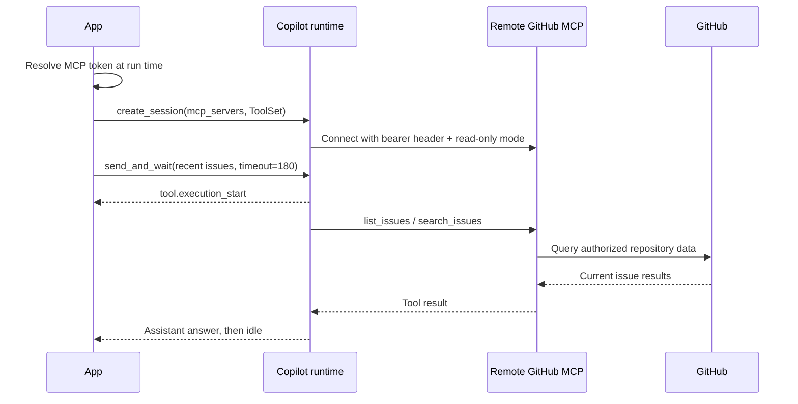

# 05 · Remote GitHub MCP

📖 **Sources:**
[SDK v1.0.13 MCP configuration](https://github.com/github/copilot-sdk/blob/v1.0.13/docs/features/mcp.md),
[SDK tool filters](https://github.com/github/copilot-sdk/blob/v1.0.13/python/test_tool_set.py),
[GitHub MCP v1.12.1 issue tools](https://github.com/github/github-mcp-server/blob/v1.12.1/pkg/github/issues.go),
[remote server](https://github.com/github/github-mcp-server/blob/v1.12.1/docs/remote-server.md).

Open [the runnable source](05_mcp_servers.py). It attaches GitHub's hosted MCP
endpoint, limits exposure to three read-only issue tools, and verifies that the
agent actually started an MCP call before accepting the turn as successful.

## The flow


```mermaid
sequenceDiagram
    participant App
    participant Runtime as Copilot runtime
    participant MCP as Remote GitHub MCP
    participant GitHub
    App->>App: Resolve MCP token at run time
    App->>Runtime: create_session(mcp_servers, ToolSet)
    Runtime->>MCP: Connect with bearer header + read-only mode
    App->>Runtime: send_and_wait(recent issues, timeout=180)
    Runtime-->>App: tool.execution_start
    Runtime->>MCP: list_issues / search_issues
    MCP->>GitHub: Query authorized repository data
    GitHub-->>MCP: Current issue results
    MCP-->>Runtime: Tool result
    Runtime-->>App: Assistant answer, then idle
```

## Code walkthrough

### 1. Separate Copilot authentication from MCP authentication

Signing in with `copilot login` authenticates the Copilot runtime/model path.
A server supplied through `mcp_servers={...}` is a separate HTTP/stdio
connection; the SDK does not copy the CLI's stored credential into arbitrary
server headers.

`github_mcp_tool_config` configures a built-in GitHub MCP server **if the
runtime already provides one**. It does not instantiate the hosted server by
itself. This self-contained sample therefore configures the remote endpoint
explicitly.

`github_token()` checks non-empty values in this order:

1. `GITHUB_TOKEN`
2. `GH_TOKEN`
3. `gh auth token --hostname github.com`

The lookup happens only inside `main()`. Missing `gh`, lookup failure, timeout,
and empty output raise clear errors without printing credential-bearing
diagnostics.

### 2. Configure HTTP authentication and read-only behavior

```python
mcp_servers = {
    "github": {
        "type": "http",
        "url": "https://api.githubcopilot.com/mcp/",
        "headers": {
            "Authorization": f"Bearer {token}",
            "X-MCP-Readonly": "true",
        },
        "tools": GITHUB_TOOLS,
    },
}
```

The MCP server's `tools` list uses raw server tool names. The session-wide
filter uses source/server-qualified names:

```python
available_tools = ToolSet()
for name in GITHUB_TOOLS:
    available_tools.add_mcp(f"github-{name}")
```

This hides unrelated built-in, custom, and MCP tools. The read-only header is
an additional server-side control. Neither replaces least-privilege token
permissions or an OS sandbox.

### 3. Require evidence of a real call

The event listener records `ToolExecutionStartData` only when
`mcp_server_name=="github"` and prints the selected tool:

```text
[mcp] github/list_issues
```

After `send_and_wait`, the example raises if no matching event was observed.
A model response such as “I will list the issues” is not treated as success.
The prompt matches slide 22:
`"List 3 recent open issues on github/copilot-sdk."`

### 4. Keep secrets and failures visible in the right places

The example never prints the token, headers, or raw tool arguments.
`send_and_wait(timeout=180)` propagates runtime/session errors; the entire
operation has a 300-second deadline and listener cleanup lives in `finally`.
The runtime-selected default model follows the official Python sample pattern.

## Run it

```bash
python examples/05_mcp_servers.py
```

Expected shape (live data and selected tools vary):

```text
[mcp] github/list_issues
1. #<number> — <current title> — @<author> — https://github.com/...
...
```

## Try this next

1. Change both owner and repository to another repository your token can read.
2. Ask for one issue's details through `issue_read`.
3. Remove one tool from both `GITHUB_TOOLS` and the `ToolSet`.
4. Replace the static header with an MCP OAuth flow and an
   `on_mcp_auth_request` handler.

## Common pitfalls

- Assuming Copilot CLI sign-in is automatically forwarded to generic MCP
  servers.
- Configuring `github_mcp_tool_config` without an available built-in server.
- Treating a plausible model answer as proof that a tool ran.
- Enabling every MCP tool to work around one misspelled name.
- Logging server config, headers, tokens, or untrusted issue bodies.
