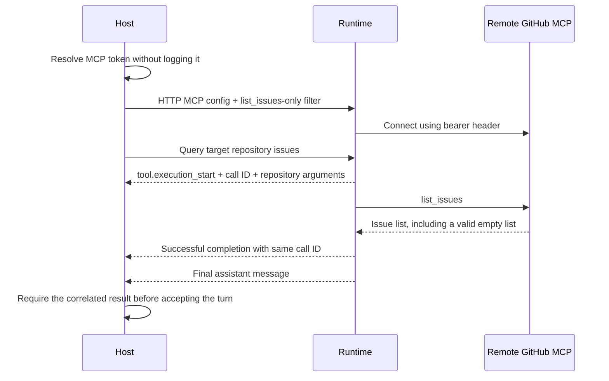

# 05 · Read repository issues through GitHub MCP

**GitHub Copilot SDK - an introduction**

[Runnable source](05_mcp_servers.py) · [Student guide](README.md)

**Sources:** [SDK v1.0.13 MCP configuration](https://github.com/github/copilot-sdk/blob/v1.0.13/docs/features/mcp.md),
[SDK event types](https://github.com/github/copilot-sdk/blob/v1.0.13/python/copilot/generated/session_events.py),
[GitHub MCP issue tools, v1.12.1](https://github.com/github/github-mcp-server/blob/v1.12.1/pkg/github/issues.go).

## Goal and boundary

Fetch recent issues on **`jeffrey-groneberg/ghcp_sdk`** as context for reviewing
the workshop's `examples/01_simple_chat.py`. An issue is context, not proof of
a code defect. This independently runnable checkpoint exposes only the
remote, read-only `list_issues` tool.


```mermaid
sequenceDiagram
    participant Host
    participant Runtime
    participant MCP as Remote GitHub MCP
    Host->>Host: Resolve MCP token without logging it
    Host->>Runtime: HTTP MCP config + list_issues-only filter
    Runtime->>MCP: Connect using bearer header
    Host->>Runtime: Query target repository issues
    Runtime-->>Host: tool.execution_start + call ID + repository arguments
    Runtime->>MCP: list_issues
    MCP-->>Runtime: Issue list, including a valid empty list
    Runtime-->>Host: Successful completion with same call ID
    Runtime-->>Host: Final assistant message
    Host->>Host: Require the correlated result before accepting the turn
```

## Important code

Copilot/model authentication and MCP HTTP authentication are separate.
`github_token()` resolves a token at run time in this order:

1. nonempty `GITHUB_TOKEN`;
2. nonempty `GH_TOKEN`;
3. `gh auth token --hostname github.com`, with a 10-second timeout.

Failures raise without printing credential-bearing subprocess diagnostics.
No credential lookup or client startup occurs during module import.
Use least-privilege credentials authorized for the target repository.

`build_mcp_servers(token)` constructs a real header from the supplied value:

```python
"headers": {
    "Authorization": "Bearer " + token,
    "X-MCP-Readonly": "true",
},
"tools": ["list_issues"],
```

Do not replace the expression with a literal token or stars. Some viewers
redact credential-shaped source strings, so displayed stars alone do not
establish that the source contains a literal placeholder. The regression
test checks two supplied token values and ensures neither is printed.

```python
available_tools=ToolSet().add_mcp("github-list_issues")
```

The MCP server list uses its raw tool name; the session filter uses the
source-qualified `mcp:github-list_issues`. No shell, file, write-issue, or
other MCP tool is exposed. The read-only header is an additional server
control, not a replacement for least-privilege authorization.

## Require the result, not just an attempt

`is_issue_query` requires the correct server, tool, **owner and repo** on
`ToolExecutionStartData`. `ToolTrace.successful_content(call_id)` requires a
matching start, successful completion, no error, and a result object.

- `[]` is a valid successful “no issues” result.
- A started call without completion is incomplete.
- A failure, missing result, wrong repository, or mismatched ID is not success.
- An assistant saying “I queried GitHub” is not evidence.

The host never logs the token, HTTP headers, raw arguments, MCP result
payload, or remote error text. Failure traces retain the tool name, call ID,
and success flag; the raised error identifies the failed verification.
Avoid printing full server configs while troubleshooting.

The turn has a 180-second deadline, the whole run 300 seconds, and listener
cleanup is in `finally`. A final assistant message remains mandatory.

## Run and inspect

```bash
python examples/05_mcp_servers.py
```

**Illustrative trace, not an observed MCP query:**

```text
[mcp] github/list_issues started id=<id>
[mcp] github/list_issues completed id=<id> success=True
[host] MCP_ISSUES_VERIFIED repo=jeffrey-groneberg/ghcp_sdk
<Current issue numbers, titles, authors and URLs — or an empty-list explanation.>
```

The hosted MCP service evolves independently of the SDK. Offline tests
verify configuration/correlation, not network availability, token access,
or the factual content of live issues.

**Exercise:** emit a failure after a valid MCP start in a mock. The script
must raise instead of treating the attempt as a completed query.
