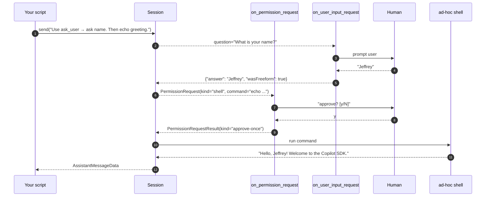

# 06 · Human in the loop

> Two callbacks let your app **stay in control** of the agent:
>
> - `on_permission_request` — fires before *any* sensitive action
>   (shell, write, read, MCP, network, ...)
> - `on_user_input_request` — fires when the agent uses the built-in
>   `ask_user` tool to ask the human a question
>
> Together they make the SDK ideal for headless services, custom IDE
> integrations and bespoke approval UIs.

## What you'll learn

- Writing a real permission handler that auto-approves some kinds and
  prompts the user for the rest
- The four valid `PermissionRequestResult` kinds
- Implementing `on_user_input_request` and returning the right
  `UserInputResponse` shape
- A useful debugging mantra: *"always import `PermissionRequestResult` from
  `copilot.session` — not from `copilot.generated.rpc`"*

## The flow



## Code walkthrough

### 1. Permission handler

```python
def on_permission_request(request, invocation) -> PermissionRequestResult:
    kind = request.kind.value     # "read" | "shell" | ...

    # auto-approve safe reads
    if kind == "read":
        return PermissionRequestResult(kind="approve-once")

    # everything else → ask the human
    print(f"\n[permission] agent wants: {kind} — {getattr(request, 'intention', '')}")
    answer = input("approve? [y/N]: ").strip().lower()
    if answer == "y":
        return PermissionRequestResult(kind="approve-once")
    return PermissionRequestResult(kind="reject")
```

The `request` object has rich context — use it to decide intelligently:

| Attribute | When relevant |
|-----------|---------------|
| `kind`    | Always — controls which other attributes are populated |
| `command` | `shell` requests — the actual command line |
| `path`    | `read` / `write` requests |
| `intention` | A short natural-language description (great for UIs) |
| `risk`    | The SDK's risk assessment (often `"low"` / `"medium"` / `"high"`) |

**Valid return kinds** (literally — only these four work):

| Kind | Meaning |
|------|---------|
| `"approve-once"` | Allow this one call |
| `"reject"` | Block. The agent sees the rejection and picks another path |
| `"user-not-available"` | No human around; SDK falls back to default policy |
| `"no-result"` | Defer. Rarely useful — only if your handler can't decide |

> ⚠️ **Import gotcha**: `PermissionRequestResult` lives in
> `copilot.session`. There is *another* class with the same name in
> `copilot.generated.rpc` — wrong one, no `kind` field, silent failure. The
> example imports correctly:
> ```python
> from copilot.session import PermissionRequestResult
> ```

### 2. ask_user handler

```python
def on_user_input_request(request, invocation) -> dict:
    question = request.get("question", "")
    choices = request.get("choices") or []
    print(f"\n[agent asks] {question}")
    if choices:
        for i, c in enumerate(choices, 1):
            print(f"  {i}. {c}")
    answer = input("your answer: ").strip()
    return {"answer": answer, "wasFreeform": True}
```

- `request` is a `UserInputRequest` TypedDict —
  `{question, choices, allowFreeform}`.
- Return must be a `UserInputResponse` TypedDict —
  `{"answer": str, "wasFreeform": bool}`.
  Returning a plain string makes the agent see an empty response and fail.
- `wasFreeform=True` tells the agent the user typed their own text rather
  than picking from `choices`.

### 3. Wiring it up

```python
async with await client.create_session(
    model="gpt-4.1",
    on_permission_request=on_permission_request,
    on_user_input_request=on_user_input_request,
) as session:
    ...
```

`on_user_input_request` is the only kwarg that activates the
`ask_user` callback path — pass it whenever you want the agent to be able to
ask follow-up questions.

### 4. A prompt that exercises both callbacks

```python
await session.send(
    "Use the ask_user tool to ask me for my name. "
    "Then run a single shell command that prints "
    "'Hello, <name>! Welcome to the Copilot SDK.' "
    "Reply with the command's output."
)
```

The agent will:

1. Call `ask_user` → triggers `on_user_input_request`
2. Compose a shell command → triggers `on_permission_request(kind="shell")`
3. Run the command and report the output

## Run it

```bash
python examples/06_human_in_the_loop.py
# Interactive — type answers when prompted.
```

Example session:

```
[agent asks] What is your name?
your answer: Jeffrey

[permission] agent wants: shell — Print personalized welcome message
approve? [y/N]: y

[agent] Hello, Jeffrey! Welcome to the Copilot SDK.
```

If you reject (`n`), the agent gives up gracefully and tells you it couldn't
complete the task.

## Try this next

1. **Build a path-based allowlist** — auto-approve `write` only inside a
   sandbox directory:
   ```python
   from pathlib import Path
   SANDBOX = Path.cwd() / "sandbox"
   if kind == "write":
       try:
           Path(request.path).resolve().relative_to(SANDBOX)
           return PermissionRequestResult(kind="approve-once")
       except ValueError:
           return PermissionRequestResult(kind="reject")
   ```
2. **Add a timeout** to the human prompt — if no answer in 30 s, return
   `kind="user-not-available"` and let the SDK fall back to defaults.
3. **Wire the callbacks to a real UI** — surface the prompt via Slack,
   Discord, a desktop notification, anything. The SDK doesn't care where
   the human lives.
4. **Add a *risk gate*** — auto-approve only if `request.risk == "low"`;
   show everything else.
5. **Log every decision** to a JSONL file for audit.

## Common pitfalls

- **Wrong import**: `from copilot.generated.rpc import PermissionRequestResult`
  imports a class with a `success: bool` field and **no** `kind`. The SDK
  catches the construction `TypeError` and silently returns
  `"user-not-available"` — the agent then reports it can't act.
- **Returning a plain string** from `on_user_input_request` — must be the
  TypedDict `{"answer": str, "wasFreeform": bool}`.
- **Blocking on `input()`** in the handlers blocks the asyncio loop. Fine
  for CLIs and demos, *not* for servers — switch to
  `await asyncio.to_thread(input, ...)` or `aioconsole`.
- **Content-exclusion policies** (in some enterprise orgs) can block reads
  even when you've approved them — that's a server-side policy, not your
  handler.

## Further reading

- Upstream permission doc: <https://github.com/github/copilot-sdk/blob/main/docs/features/permissions.md>
- Upstream ask_user / user input doc: <https://github.com/github/copilot-sdk/blob/main/docs/features/user-input.md>
- Source of truth for valid kinds:
  `copilot/session.py` → search for `PermissionRequestResultKind`.
