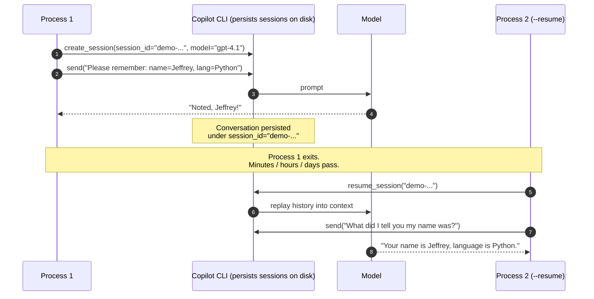

# 06 · Session persistence

📖 **Source:** [`github/copilot-sdk · docs/features/session-persistence.md`](https://github.com/github/copilot-sdk/blob/main/docs/features/session-persistence.md)

> Every Copilot SDK session has a **stable ID**. Pass the same ID to
> `create_session()` once and to `resume_session()` later, and the CLI
> replays the entire conversation history back into the model. This is the
> primitive behind any agent that "remembers" — across processes,
> deployments, browser refreshes, or overnight pauses.

## What you'll learn

- How to assign a stable `session_id` at creation time
- How `client.resume_session(session_id, ...)` re-attaches and replays
  history
- What is preserved across a resume — and what you **must** re-declare
  every time (handlers, MCP servers, custom tools)

## The proof

This demo is a deliberate memory test:

1. **Turn 1** — tell the model two facts (*"my name is Jeffrey, my
   favourite language is Python"*) and exit the process.
2. **Turn 2 (`--resume`)** — start a fresh Python process and ask the
   model to repeat those facts back, **without re-supplying them**.

If the second turn answers correctly, persistence worked. There is no
other source of the information in the second process.

## The flow



## Code walkthrough

### 1. Pick a stable session ID

```python
SESSION_ID = "demo-session-resume"
```

In production this would be a UUID per user / per conversation, stored
next to your user row in your database. The string itself is opaque —
the SDK never inspects it. *"Every conversation has an ID; persist it."*

### 2. First run — `create_session(session_id=...)`

```python
session_ctx = await client.create_session(
    on_permission_request=PermissionHandler.approve_all,
    model="gpt-4.1",
    session_id=SESSION_ID,
)
prompt = (
    "Please remember the following two facts for the rest of our "
    "conversation: my name is Jeffrey, and my favourite "
    "programming language is Python. ..."
)
```

Passing our chosen `session_id` is what makes the conversation
**addressable later**. Omit it and the SDK assigns a random UUID; you
can still resume, but you have to harvest the UUID from
`session.id` and store it yourself.

### 3. Later run — `resume_session(session_id)`

```python
session_ctx = await client.resume_session(
    SESSION_ID,
    on_permission_request=PermissionHandler.approve_all,
)
prompt = (
    "Without re-reading my earlier message, what did I tell you "
    "my name is and which programming language I prefer?"
)
```

Notice what we **don't** pass: `model=...`. The original model is
reused automatically — overriding it on resume isn't supported.

### 4. What's preserved vs. what isn't

| Preserved across resume | NOT preserved — re-declare every time |
|---|---|
| Full conversation history (user + assistant turns) | Custom tool implementations (`@define_tool` functions live in your Python process) |
| The model that was originally selected | MCP server registrations (each process spawns its own subprocesses or HTTP connections) |
| Custom agent definitions and the active agent | Permission / `ask_user` / hook callbacks (handlers are functions, not data) |
| Any session-level config (system prompt, telemetry, …) | Anything kept in your application's memory |

> 💡 **Mental model**: persistence is for the *conversation*. The
> *runtime wiring* (Python functions, network connections) is your job
> to re-establish on every process start.

## Run it

```bash
# Turn 1 — sets memory
python examples/06_session_resume.py
```

Output:

```
Noted, Jeffrey! I've recorded your name and your favourite programming
language (Python) for future reference.

Session saved as 'demo-session-resume'. Re-run with --resume to continue.
```

```bash
# Turn 2 — recalls memory (NEW Python process, no shared state)
python examples/06_session_resume.py --resume
```

Output:

```
Your name is Jeffrey, and your favorite programming language is Python.
```

The second process has zero variables, files, or arguments holding the
two facts. The model can only answer correctly because `resume_session`
replayed turn 1 back into its context.

## Try this next

1. **Forget on purpose** — delete the session: pick a brand new
   `SESSION_ID`, run the script with `--resume` first, and watch it
   fail loudly. (Helpful for understanding "session doesn't exist" errors.)
2. **Build a tiny chatbot loop** — `while True: prompt = input(); send_and_wait(...)`.
   Save `SESSION_ID` to disk; on next start, resume if the file exists.
3. **Combine with example 05** — start a session with both MCP and a
   `session_id`, then resume in a new process and watch the agent
   recall *both* the conversation and the GitHub context.
4. **Per-user IDs** — replace the hard-coded `SESSION_ID` with
   `f"user-{user_id}-{conversation_id}"` and write a tiny dict mapping
   chats to sessions. Congratulations — you now have a chat backend.

## Common pitfalls

- **Resuming a session that doesn't exist** raises a `RuntimeError` —
  the CLI has no record of the ID. (This is the "I changed my
  `SESSION_ID` and broke everything" bug.)
- **Forgetting `mcp_servers=` on resume** if you used MCP on turn 1 —
  the agent loses the MCP tools but doesn't tell you why.
- **Changing the model on resume is silently ignored** — if you need a
  different model, start a new session instead.
- **Session IDs collide across users** if your scheme isn't unique —
  prefix with the user / tenant ID.

## Further reading

- Upstream sessions doc:
  <https://github.com/github/copilot-sdk/blob/main/docs/features/session-persistence.md>
- `client.list_sessions()` enumerates the sessions the CLI currently
  knows about — useful for cleanup tooling.
