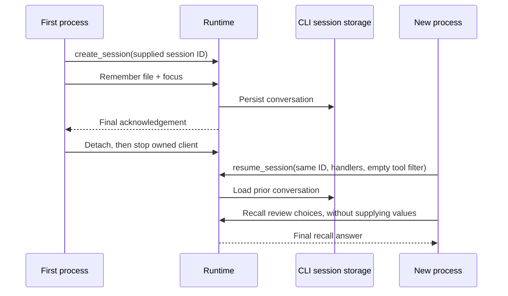

# 06 · Resume the saved review choices

**GitHub Copilot SDK - an introduction**

[Runnable source](06_session_resume.py) · [Student guide](README.md)

**Sources, SDK v1.0.13:** [create/resume implementation](https://github.com/github/copilot-sdk/blob/v1.0.13/python/copilot/client.py),
[session lifecycle](https://github.com/github/copilot-sdk/blob/v1.0.13/python/copilot/session.py).

## Goal and boundary

Persist two choices for this repository review:

- selected file: **`examples/01_simple_chat.py`**;
- review focus: **`error handling`**.

Run a second Python process to recall them. This is a cold-resume
checkpoint, not a dependency on the previous five examples. Both phases
use `available_tools=[]`, so recall cannot read answers from the source.


```mermaid
sequenceDiagram
    participant First as First process
    participant Runtime
    participant Storage as CLI session storage
    participant Second as New process
    First->>Runtime: create_session(supplied session ID)
    First->>Runtime: Remember file + focus
    Runtime->>Storage: Persist conversation
    Runtime-->>First: Final acknowledgement
    First->>Runtime: Detach, then stop owned client
    Second->>Runtime: resume_session(same ID, handlers, empty tool filter)
    Runtime->>Storage: Load prior conversation
    Second->>Runtime: Recall review choices, without supplying values
    Runtime-->>Second: Final recall answer
```

## Important code

```python
SESSION_ID = "workshop-repository-review"
REVIEW_FILE = "examples/01_simple_chat.py"
REVIEW_FOCUS = "error handling"
```

The first prompt supplies the values and asks only for acknowledgement.
The resume branch does **not** interpolate either value:

```python
session_ctx = await client.resume_session(
    session_id,
    on_permission_request=PermissionHandler.approve_all,
    available_tools=[],
)
prompt = (
    "Using our earlier conversation, state the selected review "
    "file and review focus, using the original values. If you "
    "cannot recall them, say so. Do not read any files."
)
```

In 1.0.13, `disconnect()` detaches; it does not delete persisted history.
The new process uses the same account and CLI state directory.
`--session-id` selects an independent workshop conversation; an ID is not
an authorization boundary. Create once, then resume; choose a fresh ID for
a fresh exercise.

Generated IDs also work: save `session.session_id`, or discover stored
sessions with `await client.list_sessions()`. This example never calls
the destructive `client.delete_session(...)`.

Re-register callbacks and tool exposure on cold resume. Application memory,
credentials, custom Python handlers and authorization are not persisted
Python objects. Re-supply required MCP/agent/policy configuration rather
than assuming every session option survives. In particular, injected
`managed_settings` are startup-only and must be re-supplied if needed.

Omitting `model=` retains the prior model on resume; setting it is supported
when intentionally requesting a change. Each turn requires a final message
within 60 seconds; the surrounding run has a 180-second deadline.

## Run and inspect

```bash
python examples/06_session_resume.py --session-id workshop-review-1
python examples/06_session_resume.py --resume --session-id workshop-review-1
```

**Illustrative resumed output, not an observed cold-resume run:**

```text
Session ID: workshop-review-1
The selected file is examples/01_simple_chat.py, and the focus is error handling.
```

The model uses the earlier conversation; “recall without re-reading the
earlier message” would misdescribe persistence. Offline tests ensure that
the second prompt does not resupply either fact, but live recall remains
to be checked in two processes. Long histories can be compacted; use
application storage when exact facts must be retained reliably.

**Exercise:** resume an unknown ID. A visible failure is preferable to
silently creating a new conversation and fabricating remembered choices.
