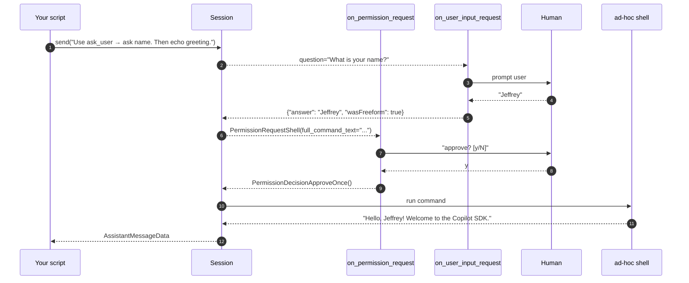

# 07 · Human in the loop

📖 **Source:** [`github/copilot-sdk · python/README — Permission Handling`](https://github.com/github/copilot-sdk/tree/main/python#permission-handling) &middot; [`python/README — User Input Requests`](https://github.com/github/copilot-sdk/tree/main/python#user-input-requests) &middot; [`docs/auth/authenticate.md`](https://github.com/github/copilot-sdk/blob/main/docs/auth/authenticate.md)

> Two callbacks let your app **stay in control** of the agent:
>
> - `on_permission_request` — fires before *any* sensitive action
>   (shell, write, read, MCP, network, ...)
> - `on_user_input_request` — fires when the agent uses the built-in
>   `ask_user` tool to ask the human a question
>
> Together they make the SDK ideal for headless services, custom IDE
> integrations and bespoke approval UIs.

## What you'll learn

- Writing a real permission handler that auto-approves some kinds and
  prompts the user for the rest
- That `PermissionRequest` is a **discriminated union** — you `match`/`case`
  on variant classes (`PermissionRequestShell`, `PermissionRequestWrite`, ...)
- Returning the right **decision object** (`PermissionDecisionApproveOnce()`,
  `PermissionDecisionReject(feedback=...)`) from `copilot.rpc`
- Implementing `on_user_input_request` and returning the right
  `UserInputResponse` shape

## The flow



## Code walkthrough

### 1. Permission handler

`request` is a **discriminated union** — a different dataclass per kind. You
`match`/`case` on the variant to read its fields, then return a **decision
object** from `copilot.rpc`:

```python
from copilot import PermissionRequestResult
from copilot.rpc import PermissionDecisionApproveOnce, PermissionDecisionReject
from copilot.session_events import (
    PermissionRequestRead,
    PermissionRequestShell,
    PermissionRequestWrite,
)


def on_permission_request(request, invocation) -> PermissionRequestResult:
    match request:
        # auto-approve safe reads
        case PermissionRequestRead():
            return PermissionDecisionApproveOnce()
        case PermissionRequestShell(full_command_text=cmd):
            detail = f"run shell command: {cmd}"
        case PermissionRequestWrite(file_name=name):
            detail = f"write file: {name}"
        case _:
            detail = getattr(request, "intention", type(request).__name__)

    # everything else → ask the human
    print(f"\n[permission] agent wants to {detail}")
    answer = input("approve? [y/N]: ").strip().lower()
    if answer == "y":
        return PermissionDecisionApproveOnce()
    return PermissionDecisionReject(feedback="User rejected the request.")
```

Each variant carries its own context — `match` to get the fields you need:

| Variant | Useful fields |
|---------|---------------|
| `PermissionRequestRead`  | `path`, `intention` |
| `PermissionRequestWrite` | `file_name`, `diff`, `intention` |
| `PermissionRequestShell` | `full_command_text`, `commands`, `intention` |
| `PermissionRequestMcp`   | `server_name`, `tool_name`, `args`, `read_only` |

**Valid return values** — decision objects from `copilot.rpc`:

| Decision | Meaning |
|----------|---------|
| `PermissionDecisionApproveOnce()` | Allow this one call |
| `PermissionDecisionReject(feedback="…")` | Block; the optional feedback is forwarded to the model so it can adapt |
| `PermissionDecisionUserNotAvailable()` | No human around; SDK falls back to its default (deny) policy |
| `PermissionNoResult()` | Leave unanswered (protocol-v1 servers only) |

> 💡 Richer, longer-lived approvals exist too — `PermissionDecisionApproveForSession`,
> `PermissionDecisionApproveForLocation`, `PermissionDecisionApprovePermanently`.
> See the generated `copilot.rpc` module for the full list.

> ⚠️ **1.0.0 change**: earlier SDKs used `PermissionRequestResult(kind="approve-once")`.
> In 1.0.0 the request has **no `kind` attribute** — `request.kind.value` raises
> `AttributeError`, which the SDK silently turns into a denial. Always `match` on
> the variant class and return a decision object instead.

### 2. ask_user handler

```python
def on_user_input_request(request, invocation) -> dict:
    question = request.get("question", "")
    choices = request.get("choices") or []
    print(f"\n[agent asks] {question}")
    if choices:
        for i, c in enumerate(choices, 1):
            print(f"  {i}. {c}")
    answer = input("your answer: ").strip()
    return {"answer": answer, "wasFreeform": True}
```

- `request` is a `UserInputRequest` TypedDict —
  `{question, choices, allowFreeform}`.
- Return must be a `UserInputResponse` TypedDict —
  `{"answer": str, "wasFreeform": bool}`.
  Returning a plain string makes the agent see an empty response and fail.
- `wasFreeform=True` tells the agent the user typed their own text rather
  than picking from `choices`.

### 3. Wiring it up

```python
async with await client.create_session(
    model="gpt-5-mini",
    on_permission_request=on_permission_request,
    on_user_input_request=on_user_input_request,
) as session:
    ...
```

`on_user_input_request` is the only kwarg that activates the
`ask_user` callback path — pass it whenever you want the agent to be able to
ask follow-up questions.

### 4. A prompt that exercises both callbacks

```python
await session.send(
    "Use the ask_user tool to ask me for my name. "
    "Then run a single shell command that prints "
    "'Hello, <name>! Welcome to the Copilot SDK.' "
    "Reply with the command's output."
)
```

The agent will:

1. Call `ask_user` → triggers `on_user_input_request`
2. Compose a shell command → triggers `on_permission_request`, matched as
   `PermissionRequestShell`
3. Run the command and report the output

## Run it

```bash
python examples/07_human_in_the_loop.py
# Interactive — type answers when prompted.
```

Example session:

```
[agent asks] What is your name?
your answer: Jeffrey

[permission] agent wants to run shell command: Write-Output 'Hello, Jeffrey! Welcome to the Copilot SDK.'
approve? [y/N]: y

[agent] Hello, Jeffrey! Welcome to the Copilot SDK.
```

If you reject (`n`), the agent gives up gracefully and tells you it couldn't
complete the task.

## Try this next

1. **Build a path-based allowlist** — auto-approve `write` only inside a
   trusted working directory:
   ```python
   from pathlib import Path
   from copilot.session_events import PermissionRequestWrite
   ALLOWED_DIR = Path.cwd() / "workdir"
   match request:
       case PermissionRequestWrite(file_name=name):
           try:
               Path(name).resolve().relative_to(ALLOWED_DIR)
               return PermissionDecisionApproveOnce()
           except ValueError:
               return PermissionDecisionReject(feedback="Outside the allowed directory.")
   ```
2. **Add a timeout** to the human prompt — if no answer in 30 s, return
   `PermissionDecisionUserNotAvailable()` and let the SDK fall back to defaults.
3. **Wire the callbacks to a real UI** — surface the prompt via Slack,
   Discord, a desktop notification, anything. The SDK doesn't care where
   the human lives.
4. **Approve a whole MCP server** — `case PermissionRequestMcp(server_name=s)`
   and auto-approve only servers you trust.
5. **Log every decision** to a JSONL file for audit.

## Common pitfalls

- **Using `request.kind`** — there is no `kind` attribute in 1.0.0.
  `request.kind.value` raises `AttributeError`, which the SDK catches and
  turns into a silent denial. Always `match` on the variant class.
- **Returning a `kind` string** like `PermissionRequestResult(kind="approve-once")`
  — 1.0.0 expects decision *objects* (`PermissionDecisionApproveOnce()`).
- **Returning a plain string** from `on_user_input_request` — must be the
  TypedDict `{"answer": str, "wasFreeform": bool}`.
- **Blocking on `input()`** in the handlers blocks the asyncio loop. Fine
  for CLIs and demos, *not* for servers — switch to
  `await asyncio.to_thread(input, ...)` or `aioconsole`.
- **Content-exclusion policies** (in some enterprise orgs) can block reads
  even when you've approved them — that's a server-side policy, not your
  handler.

## Further reading

- Upstream permission doc: <https://github.com/github/copilot-sdk/tree/main/python#permission-handling>
- Upstream ask_user / user input doc: <https://github.com/github/copilot-sdk/tree/main/python#user-input-requests>
- Source of truth for decision variants: the generated `copilot.rpc` module
  (`PermissionDecision*` classes).
