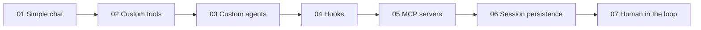

# Examples — student guide

Each example in this folder ships with **two files**:

| File | What it is |
|------|------------|
| `0N_*.py` | Runnable, heavily-commented Python source |
| `0N_*.md` | A walkthrough with a mermaid flow diagram, line-by-line explanation, expected output, exercises and common pitfalls |

Read the `.md` first, then open the `.py` and tinker.

## Recommended reading order



| # | Topic | Concepts | 📖 Upstream source |
|---|-------|----------|--------------------|
| [01](01_simple_chat.md) | **Streaming chat** | Client / session lifecycle, event stream, `match`/`case` on SDK events | [`docs/features/streaming-events.md`](https://github.com/github/copilot-sdk/blob/main/docs/features/streaming-events.md) |
| [02](02_custom_tools.md) | **Custom tools** | `@define_tool`, Pydantic schemas, request/response with `send_and_wait` | [`python/ — Tools`](https://github.com/github/copilot-sdk/tree/main/python#tools) |
| [03](03_custom_agents.md) | **Custom agents** | Multiple personas in one session, mid-conversation handoff, `rpc.agent.get_current()` to verify the swap | [`docs/features/custom-agents.md`](https://github.com/github/copilot-sdk/blob/main/docs/features/custom-agents.md) |
| [04](04_hooks.md) | **Hooks** | Pre/post tool callbacks for audit, telemetry, soft policy | [`docs/features/hooks.md`](https://github.com/github/copilot-sdk/blob/main/docs/features/hooks.md) |
| [05](05_mcp_servers.md) | **MCP servers** | Attaching the remote GitHub MCP server, scoping with a `tools` allowlist | [`docs/features/mcp.md`](https://github.com/github/copilot-sdk/blob/main/docs/features/mcp.md) |
| [06](06_session_resume.md) | **Session persistence** | Stable `session_id` + `resume_session()` proven with a memory test | [`docs/features/session-persistence.md`](https://github.com/github/copilot-sdk/blob/main/docs/features/session-persistence.md) |
| [07](07_human_in_the_loop.md) | **Human in the loop** | Custom permission handler + `ask_user` callback | [`docs/auth/authenticate.md`](https://github.com/github/copilot-sdk/blob/main/docs/auth/authenticate.md) |

## How to run

```bash
# from the repo root
python examples/01_simple_chat.py
```

All examples default to the free `gpt-4.1` model — no quota worries while learning.

## Where to look up SDK symbols

Every README links to the relevant chapter in the upstream docs:
[github/copilot-sdk → docs/](https://github.com/github/copilot-sdk/tree/main/docs).
The SDK source you have installed locally is also a great reference:

```bash
# Where the SDK lives in your venv
python -c "import copilot, pathlib; print(pathlib.Path(copilot.__file__).parent)"
```

## Adapting the examples

Each guide ends with a **"Try this next"** section — small, focused exercises
that nudge you to take ownership of the example. Pick one and modify the code:
break things on purpose, add a new tool, change the model, swap the agent
persona. That's how the patterns stick.
