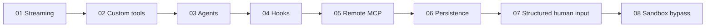

# Examples — student guide

**Workshop baseline:** `github-copilot-sdk==1.0.13`, Python 3.11+, Pydantic 2+,
Copilot CLI/runtime 1.0.83. See [setup and release notes](../README.md).

Each numbered `.py` is independently runnable; its `.md` explains the code,
shows a flow diagram, and offers exercises. Run scripts from the repository
root. The two interactive examples share only `_console_input.py`, a small
cancellable terminal-input adapter.


```mermaid
flowchart LR
    A[01 Streaming] --> B[02 Custom tools]
    B --> C[03 Agents]
    C --> D[04 Hooks]
    D --> E[05 Remote MCP]
    E --> F[06 Persistence]
    F --> G[07 Structured human input]
    G --> H[08 Sandbox bypass]
```

| Guide | Concepts | Version-pinned authority |
|---|---|---|
| [01 Streaming](01_simple_chat.md) | Client identity, events, bounded completion | [Session implementation](https://github.com/github/copilot-sdk/blob/v1.0.13/python/copilot/session.py) |
| [02 Tools](02_custom_tools.md) | Pydantic schemas and fictional weather | [Tool implementation](https://github.com/github/copilot-sdk/blob/v1.0.13/python/copilot/tools.py) |
| [03 Agents](03_custom_agents.md) | Select and verify researcher → reviewer | [Custom agents](https://github.com/github/copilot-sdk/blob/v1.0.13/docs/features/custom-agents.md) |
| [04 Hooks](04_hooks.md) | Pre/post callbacks and policy distinctions | [Hook types/dispatch](https://github.com/github/copilot-sdk/blob/v1.0.13/python/copilot/session.py) |
| [05 MCP](05_mcp_servers.md) | Remote HTTP, separate auth, issue tool allowlists | [MCP](https://github.com/github/copilot-sdk/blob/v1.0.13/docs/features/mcp.md) |
| [06 Persistence](06_session_resume.md) | Detach, saved IDs, cold resume | [Client implementation](https://github.com/github/copilot-sdk/blob/v1.0.13/python/copilot/client.py) |
| [07 Human input](07_human_in_the_loop.md) | Structured-first input with legacy fallback, exact-command approval | [Input/permission types](https://github.com/github/copilot-sdk/blob/v1.0.13/python/copilot/session.py) |
| [08 Sandbox](08_sandbox.md) | Experimental isolation and one approved bypass | [Official sandbox E2E](https://github.com/github/copilot-sdk/blob/v1.0.13/nodejs/test/e2e/sandbox_bypass.e2e.test.ts) |

Example 08 deliberately separates four controls that are often confused:
tool exposure, application authorization, OS-level containment, and a
human-approved exception. It denies a disposable vault, lets the runtime ask
for one bypass, and has the host—not the model—verify the matching successful
tool call. Read [the detailed rationale in the main README](../README.md#what-example-08-is-testing)
before treating the sample as a production security boundary.

## Shared conventions

- Model: follow the official Python samples and let the runtime choose its
  default. Inspect `await client.list_models()` before pinning a model.
  Model calls may consume your account's quota; no cost guarantee is implied.
- Context managers clean up the session and owned client. In 1.0.13,
  session `disconnect()` uses **detach**, retaining persisted state.
- `send_and_wait(..., timeout=...)` still emits events to `session.on`.
  Timeout **raises `TimeoutError`**; `None` means idle without an assistant
  message. Examples deliberately raise if a required reply is absent.
- All conversations have deadlines; callbacks do not swallow cancellation.
  Timeout stops waiting, not necessarily remote agent work.
- Tools are explicitly scoped with `ToolSet`. `available_tools` filters the
  entire merged catalogue: `builtin:view`, `custom:get_weather`,
  `mcp:github-list_issues`.
  Source: [tagged ToolSet implementation/tests](https://github.com/github/copilot-sdk/blob/v1.0.13/python/test_tool_set.py).
- `approve_all` is a trusted-workshop convenience, **not a sandbox**. Use a
  non-sensitive checkout and least-privilege credentials. Example 07 validates
  one exact command before asking; example 08 uses the experimental runtime
  sandbox and asks separately before one bypass.
- Console traces log tool names, not credentials or full MCP payloads.

## Run and inspect

```bash
python examples/01_simple_chat.py
python examples/08_sandbox.py
python -m unittest discover -s examples/tests -v  # mocked, no model calls
python -c "import copilot, pathlib; print(pathlib.Path(copilot.__file__).parent)"
```

The source walkthroughs are pinned to the stable release and cross-checked
against the official `github/copilot-sdk` samples. Consult generated Python
types when narrative docs and actual signatures differ; do not copy unreleased
examples without checking the installed version.
